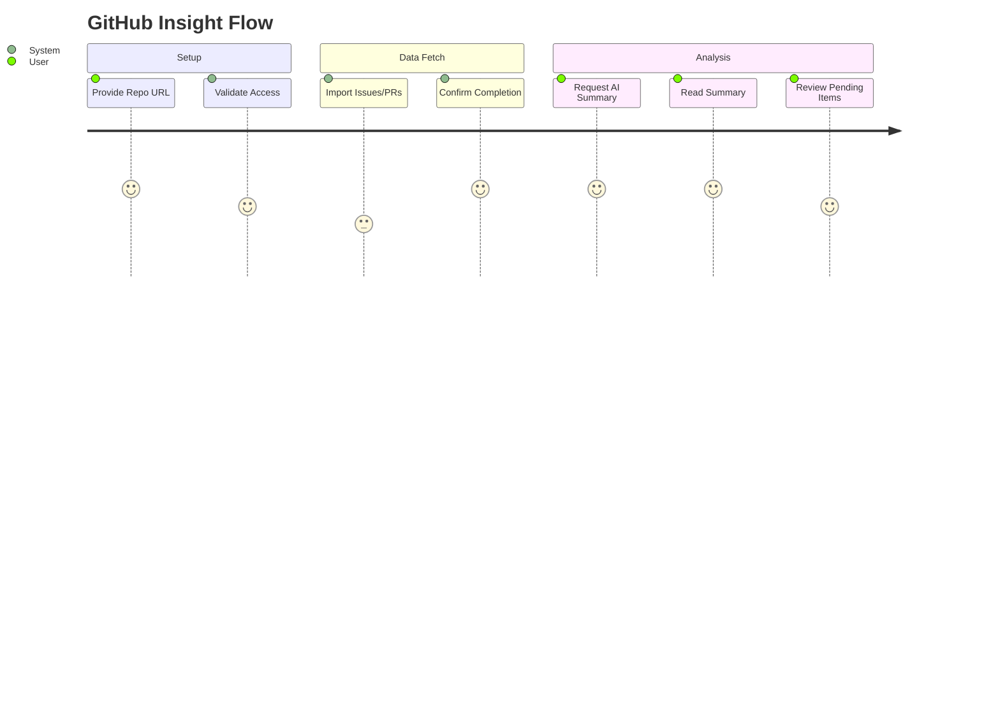
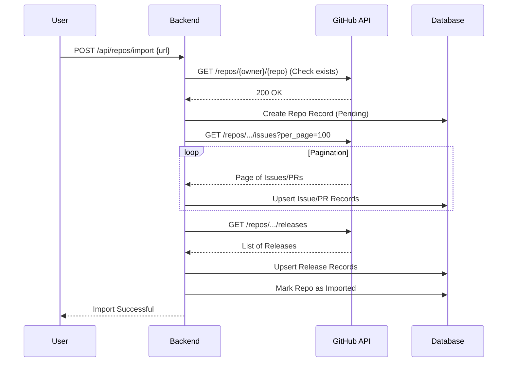

# Feature Specification: GitHub Issue Analysis

**Feature Branch**: `001-github-issue-analysis`  
**Created**: 2026-02-01  
**Status**: Draft  
**Input**: User description: "I want to retrieve information from Github repositories (Like Issues, PRs, release) no code to get, and being able to store the list of issues of those repositories. The idea is to have AI resume of the issues and being able to know what is pending on the repository."

## User Scenarios & Testing *(mandatory)*

### User Story 1 - Import Repository Data (Priority: P1)

As a user, I want to import metadata (Issues, Pull Requests, Releases) from a GitHub repository so that I can analyze it offline without downloading the source code.

**Why this priority**: foundational requirement; analysis cannot happen without data.

**Independent Test**: Trigger an import for a specific public repository and verify that the number of stored records matches the GitHub count for Issues, PRs, and Releases.

**Acceptance Scenarios**:

1. **Given** a valid GitHub repository URL and necessary credentials, **When** I trigger the import, **Then** the system should fetch all Issues, PRs, and Releases and confirm successful storage.
2. **Given** an invalid or inaccessible repository, **When** I trigger the import, **Then** the system should display a clear error message indicating the access problem.
3. **Given** a large repository, **When** the import runs, **Then** it should handle pagination to retrieve all records, not just the first page.

---

### User Story 2 - AI Repository Summary (Priority: P1)

As a user, I want an AI-generated summary of the repository's issues and status so that I can quickly understand the project's health and activity without reading hundreds of threads.

**Why this priority**: Core value proposition ("AI resume").

**Independent Test**: Request a summary for an imported repository and verify the output contains a text summary referencing key topics found in the imported data.

**Acceptance Scenarios**:

1. **Given** an imported repository with open issues, **When** I request an AI summary, **Then** the system should return a natural language overview of the main topics, recent activity, and critical problems.
2. **Given** an imported repository with no issues, **When** I request a summary, **Then** the system should indicate there is not enough data to summarize.

---

### User Story 3 - View Pending Work (Priority: P2)

As a user, I want to see a specific list of pending items (Open Issues and PRs) so that I know exactly what needs attention.

**Why this priority**: Explicit user request ("know what is pending").

**Independent Test**: Request the "pending" list and verify it only contains items with "Open" status.

**Acceptance Scenarios**:

1. **Given** an imported repository, **When** I request pending items, **Then** the system should display a list of Issues and PRs that are currently open.
2. **Given** an imported repository, **When** I request pending items, **Then** the list should be sortable by creation date or update date to highlight stale vs. new items.

---

## Visual Journeys *(mandatory)*

### User Journey Diagram

### Sequence Diagram: Metadata Import

### Edge Cases

- **Rate Limiting**: What happens if GitHub API rate limits are hit during import? (System should pause/retry or fail gracefully with specific message).
- **Data Updates**: What happens if the repo is imported twice? (System should update existing records/upsert, not duplicate).
- **Large Text**: What happens if issue bodies are too large for the AI context window? (System should truncate or summarize efficiently).

## Requirements *(mandatory)*

### Functional Requirements

- **FR-001**: System MUST fetch Issues, Pull Requests, and Releases from the GitHub API for a specified repository.
- **FR-002**: System MUST support authentication (e.g., via Environment Variables) to access private repositories and avoid low rate limits.
- **FR-003**: System MUST store retrieved metadata persistently to allow analysis without repeated API calls.
- **FR-004**: System MUST NOT download the repository source code (metadata only).
- **FR-005**: System MUST provide an AI-generated summary that aggregates information from the stored issues and PRs.
- **FR-006**: System MUST provide a filtered view of "Pending" items (Open status).
- **FR-007**: System MUST handle GitHub API pagination to ensure complete data retrieval.

### API Changes & Versioning Impact

- **New Endpoints**:
    - `POST /api/repos/import`: Trigger import of a GitHub repo.
    - `GET /api/repos/{id}/summary`: Retrieve AI summary.
    - `GET /api/repos/{id}/pending`: Retrieve list of open items.
    - `GET /api/repos`: List imported repositories.
- **Modified Endpoints**: None.
- **Breaking Changes**: No.
- **Deprecations**: None.

### Key Entities

- **Repository**: Represents the GitHub repo (Name, Owner, URL, LastUpdated).
- **Issue**: A specific issue (Title, Body, State, Labels, CreatedAt, Author).
- **PullRequest**: A specific PR (Title, Body, State, CreatedAt, Author, IsMerged).
- **Release**: A release tag (Name, Body, PublishedAt).

## Success Criteria *(mandatory)*

### Measurable Outcomes

- **SC-001**: Users can import a standard repository (e.g., 100 issues) in under 1 minute (excluding external API latency).
- **SC-002**: AI Summary is generated within 10 seconds of request for an average-sized repo.
- **SC-003**: "Pending" list accuracy is 100% relative to the GitHub data at the time of import.
- **SC-004**: System successfully handles repositories with up to 1000 issues without crashing.
