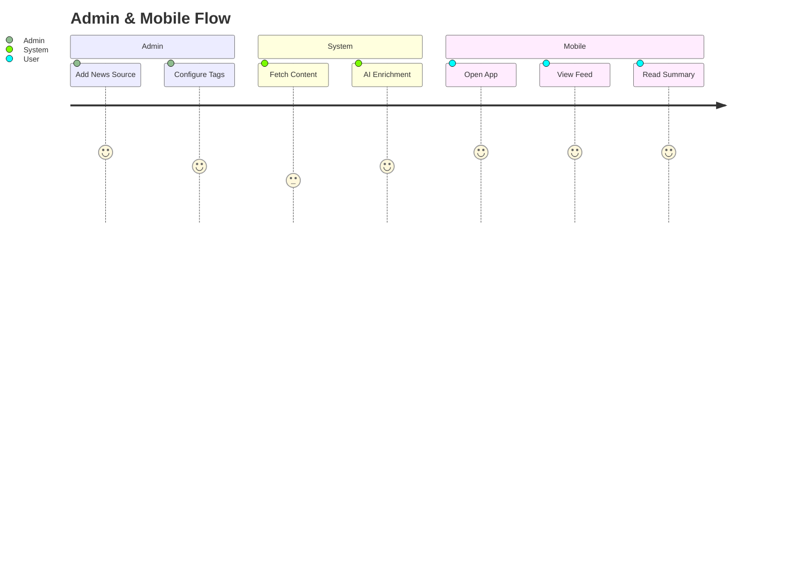
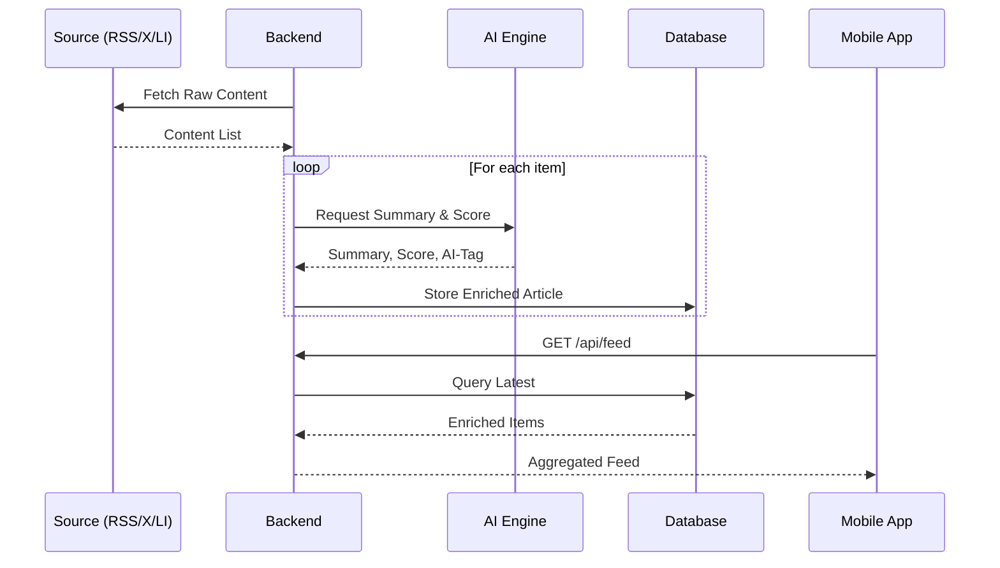

# Feature Specification: Glance Admin & News Mobile Platform

**Feature Branch**: `002-glance-admin-news-mobile`  
**Created**: 2026-02-01  
**Status**: Draft  
**Input**: User description: "The github part is only a piece, I would like a website to administrate the repo I am tracking on Github. Also I would like to have fetching of articles from news feed / or social media (Like X, LinkedIn) setup in the admin, with specific tags to retrieve them having an AI summary about it and the link to the article or post. All of those summary should be able to be displayed on a mobile app which will be read only. The articles / post should have a credibility score based on their srouce and if the information is relevant / corerct. It should be also tagged if the post / article is AI generated content"

## User Scenarios & Testing *(mandatory)*

### User Story 1 - Admin: Repository Administration (Priority: P1)

As an Admin, I want to manage (add/remove) the GitHub repositories tracked by the system via a web interface so that I can control data ingestion without touching the database or code.

**Why this priority**: Essential for managing the data sources defined in the previous feature.

**Independent Test**: Use the web admin to add a new repo URL, then verify it appears in the list and triggers the ingestion process (from Feature 001).

**Acceptance Scenarios**:

1. **Given** I am logged into the Admin Web Console, **When** I submit a valid GitHub URL, **Then** the repository is added to the tracking list and a confirmation is shown.
2. **Given** a tracked repository, **When** I click delete/remove, **Then** it is removed from the active tracking list.
3. **Given** the list view, **When** I load the page, **Then** I see all currently tracked repositories.

---

### User Story 2 - Admin: News & Social Feed Configuration (Priority: P1)

As an Admin, I want to configure external data sources (News Feeds, X/Twitter, LinkedIn) and define specific tags/keywords so that the system knows what content to fetch.

**Why this priority**: Core requirement for the new "News" capability.

**Independent Test**: Configure a new tag (e.g., "AI News") for a source (e.g., "TechCrunch RSS"), trigger a fetch, and verify articles are stored.

**Acceptance Scenarios**:

1. **Given** the Admin Web Console, **When** I add a new Source (URL/Account) and associated Tags, **Then** the configuration is saved.
2. **Given** a configured source, **When** the system runs a fetch cycle, **Then** it retrieves posts matching the defined tags.

---

### User Story 3 - System: AI Processing (Summary, Credibility, AI-Check) (Priority: P1)

As a User, I want the system to automatically summarize fetched articles, score their credibility, and detect if they are AI-generated so that I can consume high-quality information quickly.

**Why this priority**: The "Glance" value proposition relies on this AI enrichment.

**Independent Test**: Manually ingest a known article text, trigger the AI pipeline, and verify the output contains a summary, a score (0-100), and an AI-generated boolean flag.

**Acceptance Scenarios**:

1. **Given** a newly fetched article, **When** the AI pipeline runs, **Then** a concise summary is generated and stored.
2. **Given** an article from a verified source vs. an unverified blog, **When** processed, **Then** the credibility score reflects the source reliability and content coherence.
3. **Given** an article text, **When** processed, **Then** the system tags it as "AI Generated" if the probability exceeds a threshold.

---

### User Story 4 - Mobile: Read-Only Feed (Priority: P1)

As a Mobile User, I want to scroll through a feed of summarized articles and repository updates on my phone so that I can stay informed on the go.

**Why this priority**: The specific consumption channel requested by the user.

**Independent Test**: Launch the mobile app and verify it loads the list of summaries generated in previous steps.

**Acceptance Scenarios**:

1. **Given** the Mobile App, **When** opened, **Then** it displays a read-only list of recent summaries (both Code and News) sorted by date.
2. **Given** a summary card, **When** tapped, **Then** it shows the full summary, credibility score, AI tags, and a link to the original source.
3. **Given** the mobile interface, **When** I try to edit or delete content, **Then** no option exists (Read-Only).

---

## Visual Journeys *(mandatory)*

### User Journey Diagram

### Sequence Diagram: AI Enrichment Pipeline

### Edge Cases

- **Source API Limitations**: X/LinkedIn APIs often have strict rate limits or high costs. (Assumption: We will use official APIs or supported scraping methods where legally/technically viable, handling rate limits gracefully).
- **Ambiguous Credibility**: How to score if source is unknown? (Default to neutral/low score with "Unknown Source" label).
- **False Positives**: AI detection might flag human text as AI. (Display as "Likely AI" rather than definitive).

## Requirements *(mandatory)*

### Functional Requirements

- **FR-001**: System MUST provide a Web Admin Interface (React) for managing Repositories and News Sources.
- **FR-002**: System MUST fetch content from RSS Feeds (News), X (via API), and LinkedIn (via API) based on admin-defined tags.
- **FR-003**: System MUST generate an AI Summary for every fetched item.
- **FR-004**: System MUST calculate a Credibility Score (0-100) for every item based on Source Reputation and Content Consistency.
- **FR-005**: System MUST detect and tag content as "AI Generated" or "Human Written".
- **FR-006**: System MUST provide a Read-Only Mobile App (React Native) to display the aggregated feed.
- **FR-007**: Mobile App MUST display the "Credibility Score" and "AI Tag" prominently on each card.
- **FR-008**: Mobile App MUST allow opening the original source URL in a browser.

### API Changes & Versioning Impact

- **New Endpoints**:
    - `POST /api/admin/sources`: Add news/social source.
    - `GET /api/feed`: Aggregated feed for mobile (Repo Updates + News).
    - `GET /api/feed/{id}`: Detail view.
    - `POST /api/admin/repos`: (Expanded from 001) Manage tracked repos.
- **Modified Endpoints**:
    - `GET /api/repos`: May need expansion to include aggregation status.
- **Breaking Changes**: No (Additions only).
- **Deprecations**: None.

### Key Entities

- **Source**: (Type [RSS, X, LinkedIn], URL/Handle, Tags, ReliabilityScore).
- **Article**: (Title, OriginalLink, Content, PublishedAt, SourceID).
- **Enrichment**: (ArticleID, Summary, CredibilityScore, IsAIGenerated, AnalysisDate).
- **FeedItem**: Unified view of Article/RepoUpdate for the mobile stream.

## Success Criteria *(mandatory)*

### Measurable Outcomes

- **SC-001**: Admin can add a new RSS source and see fetched articles appear in the system within 15 minutes.
- **SC-002**: Mobile App loads the main feed in under 2 seconds on a 4G connection.
- **SC-003**: Credibility Score algorithm distinguishes between high-trust (e.g., official docs) and low-trust (e.g., random tweets) sources in >80% of test cases.
- **SC-004**: AI Summary reduces reading time by providing the core insight in <100 words for 95% of articles.
