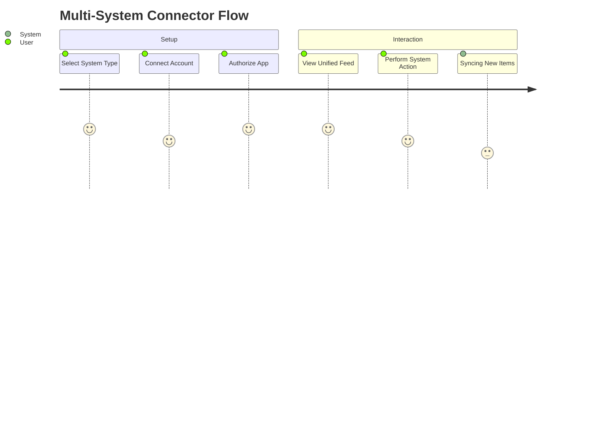
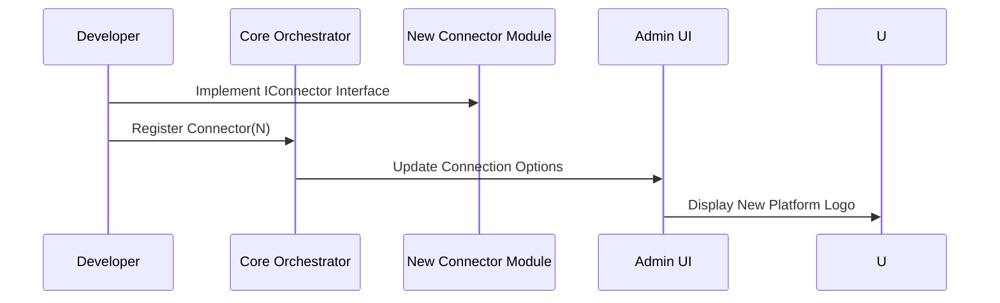

# Feature Specification: Multi-System Integration & Extensibility

**Feature Branch**: `003-multi-system-extensibility`  
**Created**: 2026-02-05  
**Status**: Draft  
**Input**: User description: "I would like to add easily in the future other systems, like Gitlab, Huggingface, Redit, X etc... It needs to be open to easily be updated to have more and more systems linked without revamping everything"

## Clarifications

### Session 2026-02-05
- Q: How should the system handle the update frequency of these external systems? → A: On-Demand with Background Refresh (Refresh on app open, then periodically in background).
- Q: If multiple systems provide the same information, should the system attempt to merge or deduplicate them? → A: No Deduplication (Show all items as distinct entries).
- Q: Should the "Glance Items" be cached locally for offline viewing? → A: Local Caching (Read-only) (Store last N items locally).
- Q: For external systems, do we expect persistent tokens or frequent re-authentication? → A: Persistent Tokens (Store refresh tokens for long-term access).
- Q: Are platform-specific actions expected to be synchronous or optimistic? → A: Optimistic UI Updates (Update UI immediately, revert on failure).

## User Scenarios & Testing *(mandatory)*

### User Story 1 - Uniform Access to Multiple Systems (Priority: P1)

As a user, I want to connect my accounts from various platforms (GitLab, Reddit, etc.) through a single interface so that I can see all my relevant data in one place.

**Why this priority**: This is the core value proposition. Without uniform access, the "multi-system" aspect isn't realized.

**Independent Test**: Connect two different external systems (e.g., GitLab and Reddit) and verify that both sets of data are visible in the Glance dashboard simultaneously.

**Acceptance Scenarios**:

1. **Given** a user is on the connections page, **When** they select "GitLab" from the list of available systems and provide credentials, **Then** GitLab is added to their active connections.
2. **Given** a user has connected GitLab and Reddit, **When** they view their dashboard, **Then** they see updates from both systems in a unified feed.

---

### User Story 2 - Standardized System Configuration (Priority: P2)

As a developer, I want a standard set of requirements/steps for adding a new system (like X or HuggingFace) so that I can integrate new platforms in a fraction of the time it took for the first one.

**Why this priority**: Addresses the "easy to update without revamping" requirement.

**Independent Test**: Attempt to add a "Dummy System" by following the established pattern and verify it appears in the UI as a selectable option without modifying the core engine code.

**Acceptance Scenarios**:

1. **Given** a new system module is added to the project, **When** the application starts, **Then** the new system automatically appears as a connection option for users.
2. **Given** a standardized configuration schema, **When** a new system is defined using this schema, **Then** the system's specific API requirements (auth, endpoints) are handled correctly by the core platform.

---

### User Story 3 - System-Specific Capabilities (Priority: P3)

As a user, I want the interface to adapt based on the system I'm interacting with so that I can perform platform-specific actions (e.g., "Star a repo" on GitLab vs "Upvote a post" on Reddit).

**Why this priority**: Enhances the utility of the integrations beyond just reading data.

**Independent Test**: Verify that for a GitLab connection, "Repository" actions are available, while for a Reddit connection, "Voting" actions are shown.

**Acceptance Scenarios**:

1. **Given** a user is viewing a GitLab item, **When** they look at available actions, **Then** they see "Star" and "Fork" options.
2. **Given** a user is viewing a Reddit item, **When** they look at available actions, **Then** they see "Upvote" and "Downvote" options.

---

## Visual Journeys *(mandatory)*

### User Journey Diagram

### Sequence Diagram: Modular Connector Registration

---

### Edge Cases

- **Auth Expiration**: How does the system handle a single system's token expiring without affecting others?
- **API Rate Limits**: What happens when one system (e.g., X) hits a rate limit? Does it block the entire dashboard?
- **Missing Capabilities**: How does the UI handle a system that doesn't support a "standard" action (e.g., a system with no "search" capability)?

## Requirements *(mandatory)*

### Functional Requirements

- **FR-001**: System MUST provide a unified "Connector" interface that all external system integrations must implement.
- **FR-002**: System MUST allow adding new system integrations via a modular registration process (e.g., adding a file or folder) without requiring changes to the core orchestrator.
- **FR-003**: System MUST support multiple concurrent active connections per user.
- **FR-004**: System MUST store and manage credentials for each system independently.
- **FR-005**: System MUST provide a standardized normalization process to convert various external data formats into a common "Glance Item" format for display.
- **FR-006**: System MUST display external items using a generic "Glance Tile" in the primary feed, showing the item content, the origin platform name, and the platform's logo (or initial if the logo is unavailable).
- **FR-007**: System MUST allow users to access a detailed view for any item, which displays platform-specific actions derived from the connector's capabilities.
- **FR-008**: System MUST allow adding new system integrations via a modular registration process (e.g., adding a configuration module) without requiring changes to the core orchestrator.
- **FR-009**: System MUST synchronize data on application launch and perform periodic background updates (every 15-30 minutes) for all active connections.
- **FR-010**: System MUST treat items from different platforms as distinct entries without automatic deduplication.
- **FR-011**: System MUST cache the most recent items locally to allow users to view their dashboard while offline.
- **FR-012**: System MUST securely store and use refresh tokens to maintain long-term access to external platforms without requiring frequent user re-authentication.
- **FR-013**: System MUST perform optimistic UI updates for platform-specific actions, providing immediate visual feedback and reverting state with a notification if the external API call fails.

### API Changes & Versioning Impact

- **New Endpoints**: 
    - `GET /api/connectors`: List all available system types.
    - `GET /api/user/connections`: List user's active connections.
    - `POST /api/user/connections`: Add a new connection.
- **Modified Endpoints**: None (Initial Implementation).
- **Breaking Changes**: No.
- **Deprecations**: None.

### Key Entities *(include if feature involves data)*

- **Connector**: Represents a type of system (GitLab, Reddit). Defines auth methods and data fetching logic.
- **Connection**: A user-specific instance of a Connector (e.g., "My GitLab Account").
- **Glance Item**: The standardized data object displayed to the user, containing content from the external system.

## Success Criteria *(mandatory)*

### Measurable Outcomes

- **SC-001**: Adding a basic "read-only" integration for a new system (e.g., HackerNews) takes less than 4 hours for a developer familiar with the codebase.
- **SC-002**: System supports at least 10 concurrent system types without performance degradation in the connection manager.
- **SC-003**: 100% of external data is successfully mapped to the "Glance Item" schema before being sent to the UI.
- **SC-004**: System successfully handles 3 simultaneous API failures from different connectors without crashing the main dashboard.