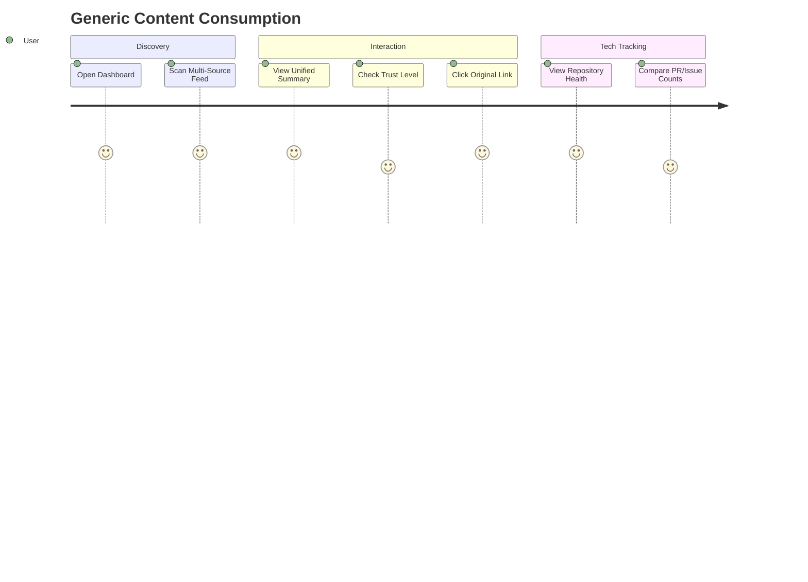
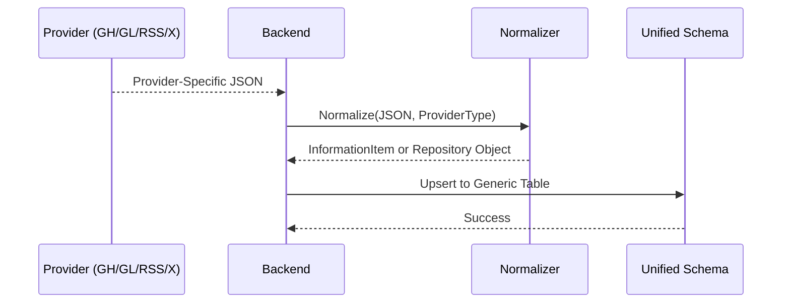

# Feature Specification: Generic Unified Data Model

**Feature Branch**: `005-generic-data-model`  
**Created**: 2026-02-07  
**Status**: Draft  
**Input**: User description: "For the data we will need to store we need to have the following, the origin of the information, the AI resume of the info, the link of the origin, the date of the info, when it was fetched, the level of trust of the information(in case of news or social media). Also in case of repositories we need more like the name of the repo to follow, since when, how many open issues, how many prs, latest version released and when, a resume of the purpose of the repo, the link to the repo. The repo could come from different provider (like Github Gitlab etc...) also maybe huggingface for instance, the idea is that the model is generic enough"

## User Scenarios & Testing *(mandatory)*

### User Story 1 - Viewing Unified Content Summaries (Priority: P1)

As a user, I want to see a concise summary of information from various sources (social media, news, blogs) so that I can quickly understand the essence of the content without visiting multiple sites.

**Why this priority**: Core value proposition of the Glance platform.

**Independent Test**: Fetch a news article and a social media post, and verify that both are displayed using the same unified summary format.

**Acceptance Scenarios**:

1. **Given** a new information item has been ingested, **When** I view the dashboard, **Then** I should see the origin, the AI-generated summary, the original link, the publication date, and the trust level.
2. **Given** a social media post with low trust, **When** I view the item, **Then** the trust level indicator should clearly reflect this status.

---

### User Story 2 - Tracking Repository Health (Priority: P1)

As a developer, I want to track the status and health of technical repositories from different providers (GitHub, GitLab, Hugging Face) in a single view so that I can monitor project activity efficiently.

**Why this priority**: Essential for the technical insights aspect of Glance.

**Independent Test**: Connect a GitHub repo and a Hugging Face model repo, and verify that both display their respective PR/Issue counts and latest versions in a unified way.

**Acceptance Scenarios**:

1. **Given** a repository is being followed, **When** I view its details, **Then** I should see the repository name, open issues, PR count, latest version with release date, and a purpose summary.
2. **Given** repositories from different providers (e.g., GitLab and Hugging Face), **When** I list my followed repositories, **Then** they should be presented using the same generic structure regardless of the provider.

---

### User Story 3 - Provider Agnostic Data Ingestion (Priority: P2)

As a system administrator, I want the data model to support any source provider without requiring schema changes so that the system remains extensible.

**Why this priority**: Ensures long-term maintainability and extensibility.

**Independent Test**: Ingest a sample data point from a mock new provider and verify it fits into the existing schema without modification.

**Acceptance Scenarios**:

1. **Given** a new provider is added, **When** data is fetched, **Then** it should map correctly to the generic information or repository entities.

---

## Visual Journeys *(mandatory)*

### User Journey Diagram

### Sequence Diagram: Generic Data Normalization

---

### Edge Cases

- **Missing Metadata**: What happens when a provider does not provide a specific field (e.g., "latest version" for a social media post)?
  - *Assumption*: The system will handle missing fields gracefully by leaving them empty or providing a default "N/A" status.
- **Varying Trust Scales**: How does the system handle different trust metrics from different providers?
  - *Assumption*: The system will normalize trust levels into a standard internal scale.

## Requirements *(mandatory)*

### Functional Requirements

- **FR-001**: System MUST store the origin (provider/source name) for every piece of information.
- **FR-002**: System MUST store an AI-generated summary (resume) for all ingested items.
- **FR-003**: System MUST store the original source link and publication date.
- **FR-004**: System MUST record the timestamp when the information was fetched.
- **FR-005**: System MUST store a trust level indicator for news and social media content.
- **FR-006**: System MUST store specific repository metadata including: name, follow start date, open issue count, PR count, latest version, and release date.
- **FR-007**: System MUST support a generic "Purpose Summary" for repositories.
- **FR-008**: System MUST be provider-agnostic, supporting GitHub, GitLab, Hugging Face, and others through a unified model.

### API Changes & Versioning Impact

- **New Endpoints**: 
  - `GET /api/v1/content`: Returns unified information summaries.
  - `GET /api/v1/repositories`: Returns unified repository status.
- **Modified Endpoints**: None.
- **Breaking Changes**: No.
- **Deprecations**: None.

### Key Entities *(include if feature involves data)*

- **InformationItem**: Represents a generic piece of content (news, social, etc.). Attributes: `origin`, `summary`, `sourceLink`, `publishedAt`, `fetchedAt`, `trustLevel`.
- **Repository**: Represents a technical project/repo. Attributes: `name`, `provider`, `followedSince`, `openIssues`, `pullRequests`, `latestVersion`, `latestVersionAt`, `purposeSummary`, `sourceLink`.

## Success Criteria *(mandatory)*

### Measurable Outcomes

- **SC-001**: 100% of supported providers map to the unified data model.
- **SC-002**: Data ingestion from a new provider takes less than 1 hour of configuration (no schema changes).
- **SC-003**: User dashboard displays unified summaries with < 500ms latency.
- **SC-004**: System successfully normalizes trust levels from at least 3 different social/news sources.
