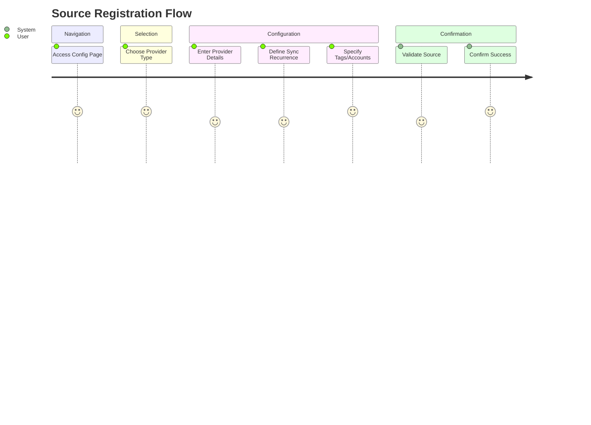
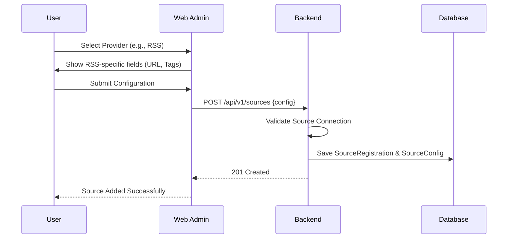

# Feature Specification: Unified Provider Registration

**Feature Branch**: `006-unified-provider-registration`  
**Created**: 2026-02-07  
**Status**: Draft  
**Input**: User description: "We are missing the registration of the social media and news feed with the tags we want to follow to know which article to fetch and summarize. We should have a single configuration page for this, for repos / news feed / social media / or any other future provider. The information asked may differ, as for the repos it could be quite simple, which repo, and few configuration like how much to fetch information, the recurrence. For news, which news feed, what tags to follow, reccurence. For social media, which social media, who to follow, which tags. The idea is to have a quite open data model, which could be open to x different social media, y repository providers, z news feed."

## User Scenarios & Testing *(mandatory)*

### User Story 1 - Configuring a Unified Data Source (Priority: P1)

As a user, I want a single interface where I can register and configure all my information sources (repositories, news feeds, and social media) so that I can manage my ingestions efficiently from one place.

**Why this priority**: Foundational feature for personalization and control over what the AI summarizes.

**Independent Test**: Successfully add one repository and one news feed through the unified configuration page and verify they appear in the system's "active sources" list.

**Acceptance Scenarios**:

1. **Given** I am on the configuration page, **When** I choose to add a "Repository", **Then** I should be prompted for the repository link, fetch volume, and recurrence.
2. **Given** I am on the configuration page, **When** I choose to add a "News Feed", **Then** I should be prompted for the feed URL, tags to follow, and recurrence.
3. **Given** I am on the configuration page, **When** I choose to add a "Social Media" source, **Then** I should be prompted for the platform, the account to follow, and specific tags.

---

### User Story 2 - Tag-Based Content Filtering (Priority: P1)

As a user, I want to specify tags for my news and social media feeds so that the AI only summarizes content that is relevant to my interests.

**Why this priority**: Reduces noise and ensures the AI summary provides high signal-to-noise ratio.

**Independent Test**: Register a news feed with the tag "TypeScript" and verify that articles without that tag (or related concepts) are ignored or marked for exclusion.

**Acceptance Scenarios**:

1. **Given** a news feed configuration, **When** I add the tag "AI", **Then** only articles matching "AI" should be processed for summarization.
2. **Given** a social media source, **When** I add tags and a specific account, **Then** only posts from that account containing those tags should be prioritized.

---

### User Story 3 - Customizing Fetch Recurrence (Priority: P2)

As a power user, I want to set how often the system checks for new updates on each of my sources so that I can balance real-time awareness with system resources.

**Why this priority**: Allows optimization of API usage and update frequency based on source volatility.

**Independent Test**: Set a 1-hour recurrence for a repo and a 24-hour recurrence for a blog, and verify the scheduling metadata reflects these choices.

**Acceptance Scenarios**:

1. **Given** a source configuration, **When** I select a recurrence interval (e.g., Hourly, Daily), **Then** the system should schedule the next fetch accordingly.

---

## Visual Journeys *(mandatory)*

### User Journey Diagram

### Sequence Diagram: Unified Source Registration

---

### Edge Cases

- **Invalid Source URL**: How does the system handle an unreachable RSS feed or a non-existent GitHub repository during registration?
  - *Assumption*: The system will perform an immediate "connection test" during registration and provide an error message if the source is invalid.
- **No Tags Specified**: What if a user registers a news feed but provides no tags?
  - *Assumption*: The system will fetch and summarize all items from that feed by default.
- **Unsupported Provider**: What if a user tries to add a provider not yet supported by the ingestion engine?
  - *Assumption*: The UI will only show supported providers, but the data model will be designed to accommodate "Custom" or "Future" types with metadata buckets.

## Requirements *(mandatory)*

### Functional Requirements

- **FR-001**: System MUST provide a unified configuration interface for all information source types.
- **FR-002**: System MUST support provider-specific configuration schemas (e.g., `tags` for news, `accounts` for social, `depth` for repos).
- **FR-003**: System MUST allow users to define a recurrence interval for each registered source.
- **FR-004**: System MUST allow users to specify a list of tags to follow for news and social media sources.
- **FR-005**: System MUST allow users to specify specific accounts/profiles to follow for social media providers.
- **FR-006**: System MUST store the registration date and the last successful fetch status for each source.
- **FR-007**: System MUST be extensible to support new provider types (X social media, Y repos, Z feeds) without database schema changes for core fields.

### API Changes & Versioning Impact

- **New Endpoints**: 
  - `POST /api/v1/sources`: Register a new information source.
  - `GET /api/v1/sources`: List all registered sources with their configurations.
  - `PUT /api/v1/sources/{id}`: Update an existing source configuration.
  - `DELETE /api/v1/sources/{id}`: Unsubscribe/Remove a source.
- **Modified Endpoints**: None.
- **Breaking Changes**: No.
- **Deprecations**: None.

### Key Entities *(include if feature involves data)*

- **SourceRegistration**: The master record for a followed source. Attributes: `type` (REPO, NEWS, SOCIAL, etc.), `providerId`, `displayName`, `isActive`, `recurrenceInterval`.
- **SourceConfig**: Provider-specific JSON-based configuration. Includes `url`, `tags`, `accounts`, `fetchLimit`.
- **SourceTag**: Link between a `SourceRegistration` and a `Tag` entity to track specific interests per source.

## Success Criteria *(mandatory)*

### Measurable Outcomes

- **SC-001**: Users can register a new source of any supported type in under 30 seconds.
- **SC-002**: 100% of registered sources successfully store their provider-specific metadata (tags, accounts).
- **SC-003**: The system correctly applies tag filters to at least 95% of incoming news articles during the mock "fetch" test.
- **SC-004**: The configuration UI dynamically renders fields based on the selected provider type.
