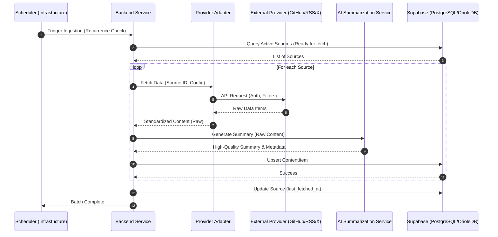

# Sequence Diagram: Ingestion Pipeline

This document details the technical flow of data from external providers into the Glance unified data model, including the AI summarization step.

## Pipeline Flow

## Step Descriptions

1.  **Scheduler**: A background job system (e.g., pg_cron or an external worker) triggers the backend.
2.  **Source Identification**: The backend identifies which sources are due for an update based on their `recurrence_interval` and `last_fetched_at`.
3.  **Provider Adaptation**: Each provider has a specific adapter that handles the nuances of their API (rate limiting, auth, pagination).
4.  **Standardization**: Raw provider data is mapped to the internal `ContentItem` structure, preserving original data in the `metadata` JSONB.
5.  **AI Summarization**: The core value prop—data is sent to an LLM to generate a concise, technical summary.
6.  **Persistence**: Items are upserted into Supabase. OrioleDB handles high-concurrency ingestion efficiently.
7.  **Real-time Update**: (Optional) Supabase Realtime notifies connected Web/Mobile clients of new content.
