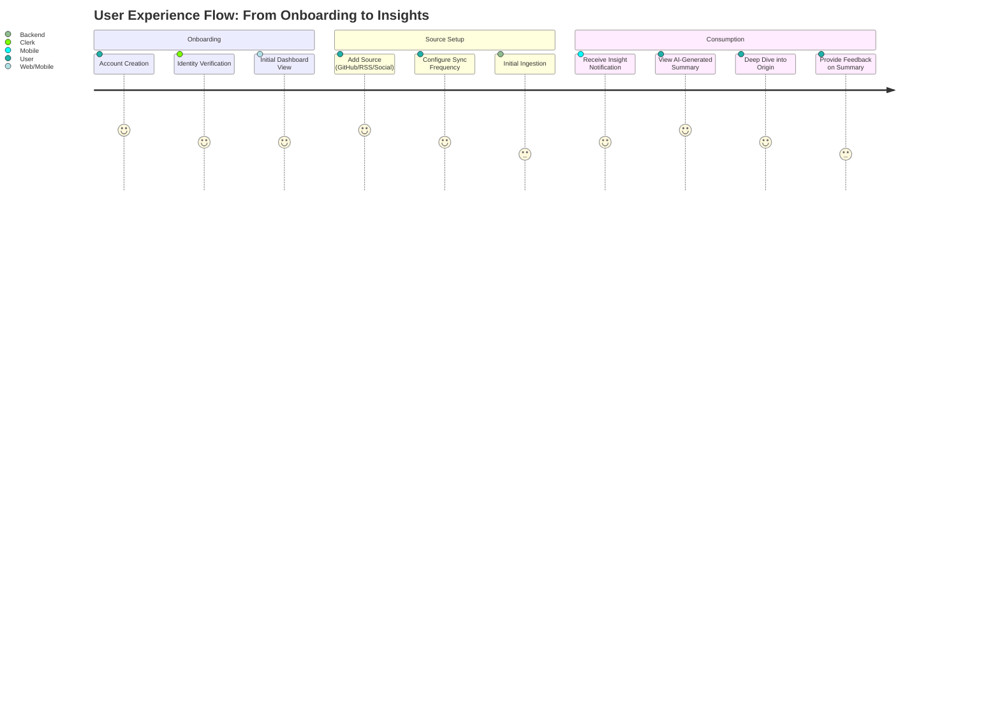

# User Journey: Glance Platform

This document outlines the primary user journey for the Glance platform, focusing on the onboarding, source management, and insight consumption phases.

## Journey Map

## Key Touchpoints

### 1. Onboarding & Auth
Users sign up via Clerk, ensuring a secure and seamless identity management experience. The first view is an empty dashboard prompting to "Add your first Glance Source".

### 2. Source Configuration
The user selects a provider (e.g., GitHub). They provide the necessary identifiers (e.g., repository URL). The system validates the source and sets up the ingestion recurrence based on user preference.

### 3. Automated Ingestion & AI Pipeline
Background workers trigger based on the recurrence interval. They fetch new data, send it to the AI summarization service, and store the "Content Item" with a high-quality summary.

### 4. Insight Review
The user receives a summary of what happened in their technical ecosystem. They can quickly scan titles and summaries, only clicking through to the original content when something requires immediate attention.
